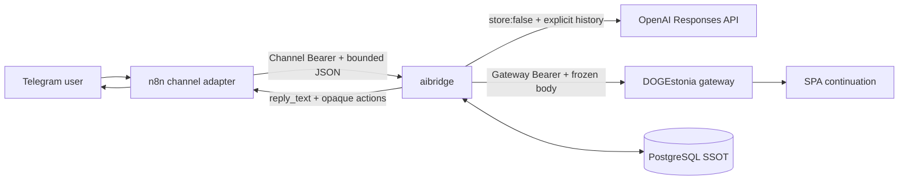
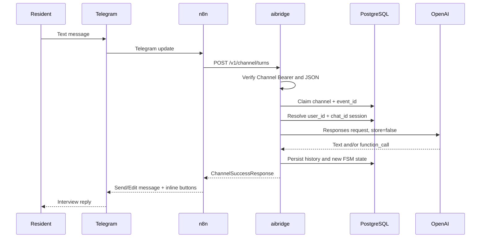
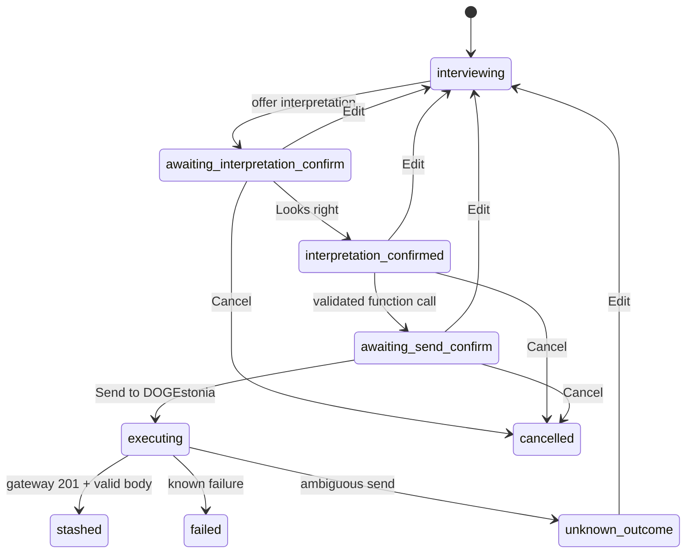

# DOGEstonia aibridge — QA guide for real inbound/outbound data flow

**Status:** implementation-aligned QA handoff  
**Target branch:** `DOGE-Complaints/doge-ai-bridge@dev`  
**Code/document snapshot reviewed:** 2026-09-17  
**Primary purpose:** provide an IDE agent with enough technical detail to implement automated contract, integration, state-machine, failure, and end-to-end tests for the already running aibridge service.  
**Channel contract SSOT:** `docs/openapi/aibridge-channel-v1.openapi.yaml`  
**Gateway contract SSOT:** `docs/openapi/story-intake-actions.openapi.yaml`  

---

## 1. How to use this document

This document describes the observable behavior that automated tests should verify across:

1. Telegram update delivery;
2. n8n field mapping and callback acknowledgement;
3. aibridge channel authentication and request validation;
4. session resolution, event deduplication, serialization, and persistence;
5. OpenAI Responses API request/response handling;
6. dual confirmation and opaque action tokens;
7. dry-run or real gateway stash;
8. conversion of the aibridge response back into Telegram messages and buttons;
9. restart, timeout, ambiguity, privacy, and security failure modes.

This is a QA specification, not a request to move product logic into n8n. Tests should preserve the intended ownership:

| Component | Responsibility |
|---|---|
| Telegram | Delivers messages and callback queries; displays messages and inline buttons. |
| n8n | Thin channel adapter: map Telegram update → aibridge request; acknowledge callbacks; map aibridge response → Telegram. |
| aibridge | Authenticate channel, own session/FSM/history, call OpenAI, validate and freeze draft, issue/consume action tokens, call gateway. |
| OpenAI Responses API | Produce interview text and, when appropriate, one allowlisted consequential function call. |
| DOGEstonia gateway | Stash a confirmed draft at `POST /story-drafts`; return `draft_id` and `trace_id`. |
| SPA | Continue resident editing/submission using the `draft_id` embedded in `continuation_url`. |
| PostgreSQL | Durable SSOT for session state, history, dedupe, tokens, locks, and gateway attempts. |

Where this document says **must**, the assertion should normally be automated. Where it says **characterization test**, the current behavior must be captured first; if product expectations differ, raise a separate implementation decision instead of silently changing the test oracle.

---

## 2. System boundaries and trust model



### 2.1 Trust boundaries

- Telegram data is untrusted input.
- n8n is trusted only as an authenticated channel client after its Channel Bearer is verified.
- `principal.user_id`, `principal.chat_id`, `language_code`, and all message text are still data, not authorization proof for gateway operations.
- The Channel Bearer and Gateway Bearer are different secrets and must never be equal.
- n8n must never receive or store the Gateway Bearer.
- n8n must never call `/story-drafts` directly.
- The model cannot authorize a gateway request. Only consumption of a valid `confirm_send` token bound to the correct principal, session, revision, deployment, state, and draft hash authorizes it.
- Raw action tokens may travel through Telegram `callback_data`, but only token hashes are persisted.
- `/metrics`, `/healthz`, and `/readyz` are operational endpoints. `/metrics` currently has no Channel Bearer middleware and therefore must remain private-network-only.

---

## 3. End-to-end flow overview

### 3.1 Ordinary message turn



### 3.2 Callback action

```mermaid
sequenceDiagram
    participant U as Resident
    participant T as Telegram
    participant N as n8n
    participant A as aibridge
    participant P as PostgreSQL
    participant G as Gateway

    U->>T: Press inline button
    T->>N: callback_query update
    N->>T: answerCallbackQuery immediately
    N->>A: POST /v1/channel/actions
    A->>P: Deduplicate event_id
    A->>P: Verify and consume token
    alt Edit, Cancel, or interpretation confirm
        A-->>N: State response; no gateway call
    else Send confirm
        A->>P: Commit executing attempt
        A->>G: POST /story-drafts with frozen body
        G-->>A: Outcome
        A->>P: Persist outcome
        A-->>N: outcome + draft_id + continuation_url
    end
    N-->>T: Send/Edit resident-safe result
```

The order `answerCallbackQuery → /actions → Send/Edit Message` is mandatory. The Telegram UX acknowledgement must not wait for OpenAI, PostgreSQL, or gateway latency.

---

## 4. Exact channel API contracts

### 4.1 Authentication

Both channel endpoints require:

```http
Authorization: Bearer <AIBRIDGE_CHANNEL_BEARER_TOKEN>
Content-Type: application/json
```

During token rotation the current and previous Channel Bearers may both be accepted. Authentication comparison is constant-time per candidate. `Bearer` matching is case-insensitive; the token value is not.

### 4.2 `POST /v1/channel/turns`

Minimal valid request:

```json
{
  "channel": "telegram",
  "event_id": "87952341",
  "principal": {
    "user_id": "293561290",
    "chat_id": "293561290"
  },
  "message": {
    "message_id": "3",
    "text": "There is not enough lighting near the playground.",
    "language_code": "en"
  }
}
```

Mapping from Telegram:

| aibridge field | Telegram source | QA constraint |
|---|---|---|
| `channel` | Constant `telegram` | Any other value → 422. |
| `event_id` | `String(update.update_id)` | Stable across retries; never generate a UUID. |
| `principal.user_id` | `String(message.from.id)` | Decimal string. |
| `principal.chat_id` | `String(message.chat.id)` | Decimal string; group IDs may be negative. |
| `message.message_id` | `String(message.message_id)` | Decimal string. |
| `message.text` | `message.text` | Non-empty string. |
| `message.language_code` | `message.from.language_code` | Optional, untrusted hint. |

### 4.3 `POST /v1/channel/actions`

Minimal valid request:

```json
{
  "channel": "telegram",
  "event_id": "87952342",
  "callback_query_id": "1234567890123456789",
  "principal": {
    "user_id": "293561290",
    "chat_id": "293561290"
  },
  "action_token": "opaque_value_copied_from_callback_query_data"
}
```

Mapping from Telegram:

| aibridge field | Telegram source | QA constraint |
|---|---|---|
| `event_id` | `String(update.update_id)` | It identifies the enclosing update, not the callback ID. |
| `callback_query_id` | `String(callback_query.id)` | Required and non-empty. |
| `principal.user_id` | `String(callback_query.from.id)` | Must match token owner. |
| `principal.chat_id` | `String(callback_query.message.chat.id)` | Must match token owner. |
| `action_token` | `callback_query.data` | Opaque; 1–64 characters/bytes in the intended Telegram path. |

n8n must not decode, interpret, prefix, sign, or reconstruct `action_token`.

### 4.4 Success envelope

Every successful channel response has exactly these fields:

```json
{
  "request_id": "2a9f847e-9ed0-42e2-94c1-9b25dc4b3a02",
  "session_id": "sess_44d6065153ae44a3",
  "state": "interviewing",
  "reply_text": "Please tell me where this happens.",
  "actions": [],
  "outcome": null,
  "draft_id": null,
  "continuation_url": null
}
```

Rules:

- `session_id` is an opaque reference, not an authorization credential.
- n8n displays `reply_text`; it does not derive business meaning from `state`.
- `actions[].token` becomes Telegram `callback_data` unchanged.
- `actions[].style` is channel metadata. Standard Telegram inline keyboards do not provide arbitrary button colors; tests should verify preservation in the aibridge envelope, not visual color rendering in Telegram.
- `draft_id` and `continuation_url` should be non-null only for `outcome=stashed`.
- `callback_ack_text` does not exist in v1 and must not be added by n8n or expected by tests.

### 4.5 Error envelope

```json
{
  "request_id": "201927ee-5ad5-43ed-9a7c-687719f37b12",
  "error": {
    "code": "semantic_invalid",
    "message": "Semantically invalid channel input",
    "retryable": false
  }
}
```

Channel-facing errors must not contain stack traces, database text, OpenAI keys, either Bearer, raw SQL, or resident narrative.

---

## 5. Session and state semantics

### 5.1 Session identity

The implementation resolves one active confirmation session by the tuple:

```text
(principal.user_id, principal.chat_id)
```

Consequences to test:

- same person in the same private chat → same session;
- same person in two different chats → two sessions;
- two people in one group chat → separate sessions because `user_id` differs;
- callback from a different user in the same group must not consume the original user’s token;
- session state survives process restart when PostgreSQL stores are active;
- after configured inactivity TTL (pilot default 7 days), narrative/history must be minimized or deleted and pending tokens invalidated according to the retention implementation.

### 5.2 Dual-confirm finite state machine



### 5.3 Buttons generated by aibridge

Interpretation confirmation bundle:

| Label | Internal action | Expected effect |
|---|---|---|
| `Looks right` | `confirm_interpretation` | Move to `interpretation_confirmed`; never call gateway. |
| `Edit` | `edit` | Return to `interviewing`; increment revision; invalidate previous tokens. |
| `Cancel` | `cancel` | Move to `cancelled`; invalidate pending tokens. |

Send confirmation bundle:

| Label | Internal action | Expected effect |
|---|---|---|
| `Send to DOGEstonia` | `confirm_send` | Authorize exactly one gateway attempt for the frozen revision. |
| `Edit` | `edit` | Return to interview; old draft/tokens become unusable. |
| `Cancel` | `cancel` | Cancel without gateway call. |

### 5.4 Freeze-before-send invariant

When OpenAI produces the one allowed function call, aibridge must:

1. require that interpretation was already confirmed;
2. require exactly one function call;
3. require the allowlisted operation `postStoryDraftStash`;
4. parse arguments as one JSON object;
5. validate tool arguments against the generated tool schema;
6. validate `schema_binding.structured_payload` against the active node pack schema;
7. inject server-owned values and validate the complete gateway wire body;
8. calculate a deterministic draft hash;
9. persist `call_id`, replay items, frozen body, and hash before returning Send/Edit/Cancel buttons;
10. send that frozen body after confirmation, never regenerate it from a later model response.

---

## 6. OpenAI Responses data flow

### 6.1 Outbound request from aibridge

For each turn, aibridge builds a Responses request with these mandatory invariants:

```json
{
  "model": "<OPENAI_MODEL>",
  "input": [
    {
      "type": "message",
      "role": "system",
      "content": "<stable instructions + tool schema + pack id>"
    },
    "<explicit prior history items>",
    {
      "type": "message",
      "role": "user",
      "content": "<current Telegram text>"
    }
  ],
  "store": false,
  "parallel_tool_calls": false,
  "tools": ["<strict generated tool>"],
  "max_output_tokens": "<configured positive limit>"
}
```

The code supports either a stable system prefix or the Responses `instructions` field, but never both. The production configuration should use one canonical prompt channel only. History is stored by aibridge/PostgreSQL and replayed explicitly because OpenAI storage is disabled.

### 6.2 Stable-prefix and cache assertions

For identical deployments, the beginning of the OpenAI input must be byte-stable in this order:

1. `<<<INSTRUCTIONS>>>` plus immutable instruction bundle;
2. `<<<TOOL_SCHEMA>>>` plus deterministically serialized tool JSON;
3. `<<<PACK_ID>>>` plus pinned pack identifier;
4. only then session history and current user content.

Automated tests should compare the prefix hash across unrelated sessions and confirm that only the dynamic suffix changes. Usage telemetry should capture cached input tokens when OpenAI reports them.

### 6.3 Inbound response from OpenAI

The response parser preserves every output item for later replay and extracts:

- response ID;
- visible `output_text` as `reply_text`;
- zero or more `function_call` items;
- each function call’s `call_id`, `name`, and `arguments`;
- token usage and cached input tokens.

Expected coordinator behavior:

| OpenAI result | aibridge behavior |
|---|---|
| Text only, session `interviewing` | Return text and mint interpretation confirmation buttons. |
| Text only, already awaiting/confirmed | Return text without re-minting duplicate buttons. |
| One allowed function call before interpretation confirmation | Fail closed in the reply; no Send buttons; no gateway. |
| One allowed function call after interpretation confirmation and all three gates pass | Freeze body; return Send/Edit/Cancel. |
| Zero visible text | Use bounded fallback such as `Acknowledged.`; never expose null. |
| Multiple consequential function calls | Reject; no gateway. |
| Unknown function name | Reject; no gateway. |
| Missing `call_id` | Reject; no gateway. |
| Invalid argument JSON or non-object arguments | Reject; no gateway. |
| Schema gate failure | Return bounded validation message; no gateway. |

After a successful stash or dry-run result, aibridge may submit a `function_call_output` using the original `call_id`. This follow-up must preserve `store:false`, explicit history, and the same canonical prompt strategy. A follow-up model failure must not erase or misrepresent the already recorded gateway outcome.

---

## 7. Gateway data flow

### 7.1 Request restrictions

Only a valid consumed `confirm_send` token may result in:

```http
POST <DOGESTONIA_API_BASE_URL>/story-drafts
Authorization: Bearer <DOGESTONIA_API_BEARER_TOKEN>
Content-Type: application/json
Accept: application/json
```

Restrictions to assert:

- gateway origin must be HTTPS;
- path is fixed to `/story-drafts`;
- redirects are disabled and treated as contract mismatch;
- Channel Bearer is never used in the gateway request;
- channel and gateway tokens cannot be equal;
- body is the previously frozen server-assembled body;
- one `(session_id, revision)` may have at most one gateway attempt;
- the `executing` attempt is committed before network I/O;
- the per-session turn lock is released before slow gateway HTTPS;
- `dry_run=true` performs local validation but no gateway HTTP.

### 7.2 Representative frozen gateway body

The exact structured payload depends on the active node pack. A representative envelope is:

```json
{
  "schema_version": "m2.story_intake_envelope.v2",
  "schema_binding": {
    "schema_id": "uus_veerenni_civic",
    "schema_version": "v3",
    "structured_payload": {
      "signals": {
        "civic_domain": "public_space",
        "failure_pattern": "insufficient_lighting"
      }
    }
  },
  "narrative": {
    "original_text": "There is not enough lighting near the playground.",
    "language": "en",
    "session_language": "en",
    "title": {
      "et": "Mänguväljaku valgustus",
      "ru": "Освещение детской площадки",
      "en": "Playground lighting"
    },
    "description": {
      "et": "Elanik kirjeldab ebapiisavat valgustust mänguväljaku juures.",
      "ru": "Житель сообщает о недостаточном освещении рядом с площадкой.",
      "en": "The resident reports insufficient lighting near the playground."
    },
    "location_query": "Uus-Veerenni playground"
  },
  "origin": {
    "source": "openai_responses_telegram"
  }
}
```

This example is illustrative. Automated fixtures must be generated from the pinned active pack and OpenAPI schemas rather than hardcoding taxonomy values from this example.

### 7.3 Gateway outcome mapping

The channel action request normally returns HTTP 200 after token consumption even when the gateway outcome is a product/remote outcome. Tests must assert the envelope’s `outcome`, state, and safe text rather than assuming the gateway’s status is copied to n8n.

| Gateway/network result | aibridge `outcome` | Required channel behavior |
|---|---|---|
| Dry-run validation succeeds | `dry_run_ok` | No HTTP post; explicitly say draft was not sent. |
| HTTP 201 with valid `data.draft_id` and `trace_id` | `stashed` | State `stashed`; return `draft_id` and SPA `continuation_url`; state clearly that it is not published. |
| HTTP 201 with malformed/missing fields | `contract_mismatch` | No draft/URL; do not claim stash. |
| HTTP 400 | `validation_error` | Known failure; no automatic retry by n8n unless product policy explicitly says so. |
| HTTP 401 | `gateway_unauthorized` | Configuration/security failure; no resident secret details. |
| HTTP 422 | `geo_scope_mismatch` | Resident-safe correction flow; no draft/URL. |
| HTTP 429 | `transient_failure` | Known remote failure; no duplicate send without an explicit safe retry design. |
| HTTP 5xx | `transient_failure` | Known remote failure; no false success. |
| Timeout/disconnect after request may have been sent | `unknown_outcome` | Block automatic resend for that revision; operator reconciliation required. |
| Other unexpected HTTP status | `unknown_outcome` | Same no-resend rule. |
| Redirect/final URL differs | `contract_mismatch` | Redirect not followed. |
| Response exceeds configured maximum | `contract_mismatch` | Body not trusted. |
| Failure proven before send | `internal_bridge_error` | `http_posted=false`; no stash claim. |
| Send without confirmation | `blocked_by_confirmation` | No HTTP post. |

For `stashed`, continuation URL format is currently:

```text
<DOGESTONIA_DRAFT_REDIRECT_BASE_URL>/#/story/submit?draft_id=<URL-encoded draft_id>
```

---

## 8. PostgreSQL persistence assertions

The versioned migration defines these operational records:

| Table | QA purpose |
|---|---|
| `schema_migrations` | Readiness verifies required migration versions. |
| `content_bundle` | Pin instruction, OAS, pack, and tool schema hashes. |
| `session` | Pin deployment/content bundle and activity state. |
| `event_dedupe` | Replay original HTTP status/body for `(channel,event_id)`. |
| `action_token` | Store token hash, owner, revision, expiry, expected state, and status. |
| `session_call` | Enforce call ID uniqueness within a session. |
| `gateway_attempt` | Enforce one attempt per session revision and preserve outcome. |
| `session_turn_lock` | Serialize concurrent turns for one session. |
| `conversation_history` | Explicit Responses history replay under `store:false`. |
| `confirm_session` | Durable dual-confirm state and frozen pending call metadata. |

Persistence tests should inspect records using a dedicated test database and transactions. Production tests must not query or mutate resident data directly.

---

## 9. Automated test layers

### Layer A — pure unit tests

No network or real database. Cover parsing, state transitions, token verification, three validation gates, gateway status mapping, response parsing, redaction, and URL generation.

### Layer B — application contract tests

Run FastAPI/ASGI in-process with fake OpenAI and gateway transports. Cover HTTP status, exact envelopes, middleware ordering, body limits, authentication, rate limiting, and dedupe.

### Layer C — PostgreSQL integration tests

Run migrations against disposable PostgreSQL. Cover durable dedupe, session/history/token persistence, locks, gateway attempt uniqueness, restart recovery, TTL cleanup, and migration readiness.

### Layer D — container/deployment tests

Build the real image with a pinned content bundle. Verify start command, `$PORT`, `/healthz`, `/readyz`, `/metrics`, environment fail-closed rules, and no accidental public dependencies.

### Layer E — n8n contract tests

Use recorded Telegram updates and a test aibridge. Verify field expressions, fixed event IDs across retries, immediate callback acknowledgement, headers, routing, and response-to-keyboard mapping.

### Layer F — live pilot smoke

Use a dedicated Telegram test bot/chat and non-production test user. First run with `AIBRIDGE_DRY_RUN=true`; then separately run an authorized staging gateway stash. Do not make destructive or production Story submissions.

---

## 10. Core test matrix

The IDs below should be stable automation identifiers.

### 10.1 Authentication and operational boundaries

| ID | Scenario | Expected result |
|---|---|---|
| AUTH-001 | Valid current Channel Bearer on `/turns` | Request reaches validation/processing. |
| AUTH-002 | Valid previous Channel Bearer during rotation | Accepted. |
| AUTH-003 | Missing Authorization | 401 `unauthorized`, redacted body. |
| AUTH-004 | Wrong scheme, e.g. `Basic` | 401. |
| AUTH-005 | `Bearer` without value | 401. |
| AUTH-006 | Wrong token of same length | 401. |
| AUTH-007 | Wrong token of different length | 401 without timing-dependent functional difference. |
| AUTH-008 | Gateway Bearer supplied to channel endpoint | 401 unless misconfigured equal; readiness must reject equality. |
| AUTH-009 | Channel Bearer appears in logs/metrics/error | Fail test; secret must be absent. |
| AUTH-010 | `/healthz` without Bearer | 200 `{"status":"ok"}`. |
| AUTH-011 | `/readyz` without Bearer | 200 ready or 503 bounded reason; no generation/write. |
| AUTH-012 | `/metrics` from allowed private test network | Prometheus text; no PII/secrets. |

### 10.2 JSON and schema boundary

| ID | Scenario | Expected result |
|---|---|---|
| VAL-001 | Valid `/turns` body | 200 bounded success. |
| VAL-002 | Valid `/actions` body | 200 or token-domain 403/404/409. |
| VAL-003 | Malformed JSON | 400 `bad_request`. |
| VAL-004 | Invalid UTF-8 body | 400 `bad_request`. |
| VAL-005 | Unknown top-level field | 400 `bad_request`. |
| VAL-006 | Unknown nested field | 400 `bad_request`. |
| VAL-007 | Missing required field | 422 `semantic_invalid`. |
| VAL-008 | `channel` other than `telegram` | 422. |
| VAL-009 | Empty `event_id` | 422. |
| VAL-010 | Numeric Telegram ID instead of string | 422. |
| VAL-011 | Non-decimal `user_id`, `chat_id`, or `message_id` | 422. |
| VAL-012 | Negative group `chat_id` decimal string | Accepted. |
| VAL-013 | Empty message text | 422. |
| VAL-014 | Whitespace-only message | Characterization: currently passes min-length; record result and open product decision if trimming is required. |
| VAL-015 | Action token length 65 | 422. |
| VAL-016 | Body exceeds `AIBRIDGE_MAX_REQUEST_BYTES` | 413 `payload_too_large`; no OpenAI/DB side effect beyond request handling. |
| VAL-017 | Invalid/negative Content-Length | 400 bounded error. |
| VAL-018 | Missing `Content-Type` but valid JSON | Characterization test; OAS requires JSON even if current parser accepts raw body. |

### 10.3 n8n and Telegram mapping

| ID | Scenario | Expected result |
|---|---|---|
| N8N-001 | Private text message | Correct `/turns` mapping; one reply. |
| N8N-002 | `/start` command | Sent as ordinary text; model/instructions decide response. |
| N8N-003 | Russian text | Unicode preserved; language hint optional. |
| N8N-004 | Estonian text | Unicode preserved. |
| N8N-005 | Mixed-language message | Text unchanged; hint must not override actual content. |
| N8N-006 | Emoji and combining characters | Round-trip without corruption. |
| N8N-007 | Group message from user A | Principal = A + group chat. |
| N8N-008 | Same group message from user B | Separate session. |
| N8N-009 | Edited message update | Must not be silently treated as a new ordinary message unless workflow explicitly supports it. |
| N8N-010 | Photo/document/voice without text | Do not build invalid `/turns`; route to explicit unsupported-content response or future adapter. |
| N8N-011 | Media with caption | Product decision/characterization: caption may be mapped as text only if workflow explicitly documents it. |
| N8N-012 | Channel post, poll, shipping/pre-checkout update | Must not enter this workflow branch. |
| N8N-013 | Callback query | `answerCallbackQuery` occurs before `/actions`. |
| N8N-014 | aibridge slow/unavailable after callback | Telegram callback still acknowledged promptly; later resident-safe error handling. |
| N8N-015 | `actions=[]` | No inline keyboard added. |
| N8N-016 | Three actions | Labels/tokens mapped in order; token unchanged. |
| N8N-017 | `outcome=stashed` | Render continuation link; do not claim publication. |
| N8N-018 | Non-stashed outcome with accidental draft/URL | Adapter should not present link; contract test should fail producer inconsistency. |

### 10.4 Idempotency and concurrency

| ID | Scenario | Expected result |
|---|---|---|
| IDEM-001 | Same `/turns` request and same event ID twice | Same stored response; one OpenAI call. |
| IDEM-002 | Retry uses new event ID | Demonstrate why this is wrong: second OpenAI call; n8n test must prevent it. |
| IDEM-003 | Same event ID but different body | First stored result wins; no second side effect; log safe collision signal if implemented. |
| IDEM-004 | Two concurrent identical turns | One claim/one OpenAI call; second waits/replays or receives bounded in-flight response. |
| IDEM-005 | OpenAI exception after dedupe claim | Claim aborted; a safe retry can process again. |
| IDEM-006 | Same callback update retried | Same stored `/actions` envelope; token not executed twice. |
| IDEM-007 | Two concurrent Send callbacks with different update IDs but same token | Exactly one consumes token/attempts gateway; other gets conflict. |
| IDEM-008 | Two different messages for same session concurrently | Serialized by session lock; history order deterministic. |
| IDEM-009 | Messages for different sessions concurrently | May proceed independently; no global serialization. |
| IDEM-010 | `/turns` and `/actions` accidentally reuse same channel/event ID | Dedupe namespace collision is safely replayed; workflow must use genuine unique Telegram update IDs. |

### 10.5 OpenAI and prompt behavior

| ID | Scenario | Expected result |
|---|---|---|
| OAI-001 | Ordinary text response | 200, visible reply, interpretation buttons on first interviewing response. |
| OAI-002 | Empty output array | Bounded fallback text; no crash. |
| OAI-003 | Output containing `Received:` stub | Stub not echoed; mapped to `Acknowledged.`. |
| OAI-004 | Valid cached token usage | Cache metric records value. |
| OAI-005 | `store` attempted true by config | Startup/settings or readiness fails closed. |
| OAI-006 | Both stable prefix and `instructions` used | Fail test; mutually exclusive. |
| OAI-007 | Parallel tool calls requested | Fail test; must be false. |
| OAI-008 | OpenAI 429 | Bounded internal channel error under current implementation; no secret/raw response; no gateway. |
| OAI-009 | OpenAI 5xx | Same bounded failure; retry policy belongs outside unsafe consequential send path. |
| OAI-010 | OpenAI timeout | Bounded 500 `internal_error`, `retryable=true`; dedupe claim aborted so message retry can run. |
| OAI-011 | Invalid OpenAI JSON/body | Bounded error, no history corruption or gateway. |
| OAI-012 | Input/output/call/turn budget breach | No gateway; last confirmed state preserved; resident-safe rejection. |
| OAI-013 | Malicious prompt asks to reveal instructions/tokens | No secret or system prompt disclosure in output/logs. |
| OAI-014 | User text contains JSON/tool-looking syntax | Treated as user content, not trusted function call. |
| OAI-015 | Stable prefix across two sessions | Identical prefix bytes/hash for same bundle/model/tool/pack. |
| OAI-016 | Content bundle changes | New deployment/session uses new pinned bundle; active pinned session behavior follows bundle retention policy. |

### 10.6 Tool-call validation

| ID | Scenario | Expected result |
|---|---|---|
| TOOL-001 | Function call before `Looks right` | Blocked; no Send buttons/gateway. |
| TOOL-002 | Exactly one allowed call after interpretation confirmation | Three gates run; frozen intent persisted; Send buttons returned. |
| TOOL-003 | Two function calls | Rejected. |
| TOOL-004 | Unknown tool name | Rejected. |
| TOOL-005 | Missing call ID | Rejected. |
| TOOL-006 | Malformed argument string | Rejected. |
| TOOL-007 | Arguments are array/scalar | Rejected. |
| TOOL-008 | Gate 1 type/required/enum/const/bounds failure | Rejected before freeze. |
| TOOL-009 | Missing `structured_payload` | Gate 2 failure. |
| TOOL-010 | Node-pack payload violates active schema | Gate 2 failure. |
| TOOL-011 | Complete body violates gateway wire schema | Gate 3 failure. |
| TOOL-012 | Model tries to override server-owned schema/origin fields | Values stripped/replaced by server constants. |
| TOOL-013 | Persist failure before actions are returned | No Send actions exposed; fail closed. |
| TOOL-014 | Same call ID replay | No duplicate consequential execution. |

### 10.7 Action token and FSM cases

| ID | Scenario | Expected result |
|---|---|---|
| ACT-001 | Valid `Looks right` token by owner | 200; `interpretation_confirmed`; zero gateway calls. |
| ACT-002 | Valid Edit token | 200; `interviewing`; revision incremented; sibling tokens invalidated. |
| ACT-003 | Valid Cancel token | 200; `cancelled`; pending tokens invalidated; no gateway. |
| ACT-004 | Valid Send token | One authorized attempt using frozen body. |
| ACT-005 | Random token | 404 `not_found`. |
| ACT-006 | Token owned by different user | 403 `forbidden`. |
| ACT-007 | Correct user, different chat | 403. |
| ACT-008 | Expired token | 409 `conflict`. |
| ACT-009 | Already consumed token, new event ID | 409. |
| ACT-010 | Invalidated sibling token after another action | 409. |
| ACT-011 | Token revision differs from session | 409. |
| ACT-012 | Token expected state differs | 409. |
| ACT-013 | Token deployment differs | 409 for Send. |
| ACT-014 | Draft hash differs | 409 for Send. |
| ACT-015 | Frozen tool intent missing | 409; gateway not called. |
| ACT-016 | Illegal FSM transition | 409. |
| ACT-017 | Raw token found in PostgreSQL/logs | Fail security test; only hash may persist. |
| ACT-018 | Token longer than Telegram limit | 422 at façade; generated tokens must remain ≤64 bytes. |

### 10.8 Gateway and continuation cases

| ID | Scenario | Expected result |
|---|---|---|
| GW-001 | Dry-run Send | `dry_run_ok`; no HTTP transport call; no published/stashed claim. |
| GW-002 | Valid 201 | `stashed`, state `stashed`, URL-encoded continuation URL. |
| GW-003 | 201 missing `trace_id` | `contract_mismatch`. |
| GW-004 | 201 missing `draft_id` | `contract_mismatch`. |
| GW-005 | 201 invalid JSON/non-object | `contract_mismatch`. |
| GW-006 | 400 | `validation_error`. |
| GW-007 | 401 | `gateway_unauthorized`; no credential leak. |
| GW-008 | 422 | `geo_scope_mismatch`. |
| GW-009 | 429 | `transient_failure`. |
| GW-010 | 500–599 | `transient_failure`. |
| GW-011 | Timeout/disconnect after attempted post | `unknown_outcome`; same revision cannot auto-Send again. |
| GW-012 | Unusual status such as 204/409 | `unknown_outcome` under current mapping. |
| GW-013 | Redirect response/final URL changes | `contract_mismatch`; no redirect follow. |
| GW-014 | Oversized response | `contract_mismatch`. |
| GW-015 | Non-HTTPS origin | readiness/executor fails closed. |
| GW-016 | Channel and gateway Bearers equal | readiness fails; no traffic accepted as ready. |
| GW-017 | Gateway call attempted from interpretation confirmation | Fail test; zero calls. |
| GW-018 | Gateway call attempted from Edit/Cancel | Fail test. |
| GW-019 | Restart while attempt is `executing` | Recover to `unknown_outcome`; do not resend automatically. |
| GW-020 | Function-call follow-up fails after successful stash | Stash outcome remains authoritative. |

### 10.9 Restart, lifecycle, and retention

| ID | Scenario | Expected result |
|---|---|---|
| LIFE-001 | Graceful shutdown begins | New channel requests receive 503 `shutting_down`, retryable true. |
| LIFE-002 | Restart during ordinary interview | PostgreSQL history/session restored; no duplicate confirmed side effect. |
| LIFE-003 | Restart after buttons issued | Pending token remains usable until TTL, if persistence is active. |
| LIFE-004 | Restart after token consumed | Token remains consumed. |
| LIFE-005 | Restart with open gateway attempt | Mark unknown and require reconciliation. |
| LIFE-006 | Session inactive beyond TTL | New session; old narrative minimized/deleted; old tokens unusable. |
| LIFE-007 | Content bundle still referenced by active session | Bundle retained until safe GC. |
| LIFE-008 | Bundle unreferenced after grace period | Eligible for GC without breaking active sessions. |
| LIFE-009 | New message after `cancelled` | Characterization test: document whether current session restarts or remains terminal; raise mismatch if resident cannot start over. |
| LIFE-010 | New message after `stashed` | Characterization test: verify intended creation of next story/session; current behavior must not silently trap resident in terminal state. |
| LIFE-011 | Edit from `unknown_outcome` | New revision/interview allowed; old revision remains non-resendable. |
| LIFE-012 | Same deployment ID changes unexpectedly | Existing token must not become valid for a different deployment. |

### 10.10 Privacy, logs, and observability

| ID | Scenario | Expected result |
|---|---|---|
| SEC-001 | Narrative contains email/phone/personal name | Full narrative absent from structured audit logs and metrics. |
| SEC-002 | Error raised with secret in exception text | Secret redacted from response/logs. |
| SEC-003 | Channel request audited | Log only bounded IDs/statuses/lengths; not raw Bearer or full narrative. |
| SEC-004 | `/metrics` scrape | Contains counts/latencies/cache telemetry only; no IDs, text, token, draft body, or URL secrets. |
| SEC-005 | Error envelope | Stable bounded schema and generated `request_id`. |
| SEC-006 | PostgreSQL token inspection | Only token hash stored. |
| SEC-007 | OpenAI request capture | `store=false`; no gateway/channel secrets. |
| SEC-008 | Gateway request capture | Gateway Bearer only; no Channel Bearer. |
| SEC-009 | n8n workflow export | No credentials or secrets committed. |
| SEC-010 | Prompt injection asks model to call arbitrary URL/tool | Only allowlisted generated function is available; gateway origin/path remain server-owned. |

### 10.11 Readiness and configuration

| ID | Scenario | Expected `/readyz` result |
|---|---|---|
| READY-001 | Complete valid configuration and migrated PostgreSQL | 200 `ready`. |
| READY-002 | Channel Bearer missing | 503 `channel_auth_missing`. |
| READY-003 | Gateway Bearer missing | 503 `gateway_bearer_missing`. |
| READY-004 | Bearers equal | 503 `channel_gateway_bearer_equal`. |
| READY-005 | Gateway URL missing/conflicting/non-HTTPS | Corresponding bounded reason. |
| READY-006 | SPA redirect base invalid | 503 `draft_redirect_base_invalid`. |
| READY-007 | OpenAI key/model missing | 503 `openai_config_missing`. |
| READY-008 | OpenAI storage requested true | Settings/readiness fails closed. |
| READY-009 | Live mode without completed schema validation flag | 503 `dry_run_required`. |
| READY-010 | Content manifest/hash/path invalid | 503 bundle reason. |
| READY-011 | Tool generation fails | 503 `tool_gen_failed:*`. |
| READY-012 | PostgreSQL unreachable | 503 `database_unreachable`. |
| READY-013 | Required migration missing/mismatch | 503 migration reason. |
| READY-014 | Non-Postgres store while memory stores forbidden | 503 `database_not_postgres`. |
| READY-015 | `/readyz` called | No OpenAI generation and no gateway write. |

---

## 11. Product-journey scenarios

### UC-01 — Normal interview, dry-run

1. Resident sends a civic observation.
2. n8n sends `/turns` with Telegram update ID.
3. aibridge/OpenAI asks a clarification and returns `Looks right`, `Edit`, `Cancel`.
4. Resident chooses `Edit`; previous buttons become invalid.
5. Resident provides corrected information.
6. Resident chooses `Looks right`.
7. Model produces one valid `postStoryDraftStash` function call.
8. aibridge returns `Send to DOGEstonia`, `Edit`, `Cancel`.
9. Resident sends.
10. With dry-run enabled, response is `dry_run_ok`; no gateway request; message explicitly says nothing was sent.

Assertions: stable session, revision change after Edit, no duplicate OpenAI calls on retry, zero gateway posts, all old tokens invalid.

### UC-02 — Normal live stash

Same as UC-01 with dry-run disabled and a staging gateway returning valid 201.

Assertions: one gateway post, `outcome=stashed`, `draft_id`, continuation URL, state `stashed`, and resident wording says “draft stashed/not published.”

### UC-03 — Resident cancels at first confirmation

Assertions: `cancelled`, no function call required, no gateway, pending actions invalid. A following new resident message must be covered by LIFE-009.

### UC-04 — Resident cancels immediately before Send

Assertions: frozen draft is not posted, all send tokens invalid, no continuation URL.

### UC-05 — Group chat ownership attack

User A starts a story and receives buttons in a group. User B sends the visible callback token.

Assertions: 403 `forbidden`; A’s token remains governed by intended consume semantics; no gateway; no cross-user state exposure.

### UC-06 — Telegram retry storm

n8n retries the same update 5–20 times with the same `event_id` after a network timeout.

Assertions: one OpenAI call or one gateway attempt, deterministic replayed response, no duplicate Telegram buttons created by aibridge. Adapter-level duplicate outgoing Telegram messages may require n8n-specific delivery dedupe and should be measured separately.

### UC-07 — Ambiguous gateway timeout

The gateway receives or may receive the request, but aibridge times out before a response.

Assertions: `unknown_outcome`; revision blocked from re-Send; restart preserves ambiguity; operator runbook required; no automatic retry.

### UC-08 — Geo scope mismatch

Gateway returns 422.

Assertions: `geo_scope_mismatch`, no draft/URL, resident-safe message, state does not claim success. Product UX for correcting location should be tested as a follow-up/edit journey.

### UC-09 — Unsupported Telegram content

Resident sends voice, sticker, photo, or document without text.

Assertions: n8n does not fabricate empty text or send an invalid request. Current v1 façade is text-only; adapter returns a clear supported-input prompt or routes to a future transcription/attachment flow.

### UC-10 — Multilingual story

Resident begins in Russian, adds an Estonian place name, then switches to English.

Assertions: raw user messages preserved; session language policy comes from instructions/model logic, not blindly from Telegram `language_code`; final gateway body validates required `{et,ru,en}` fields.

---

## 12. Test fixtures and fakes

Create deterministic fixture families:

```text
tests/fixtures/telegram/
  message-private-en.json
  message-private-ru.json
  message-group-negative-chat-id.json
  callback-owner.json
  callback-other-user.json
  photo-no-text.json
  voice-no-text.json

tests/fixtures/openai/
  text-only.json
  empty-output.json
  valid-function-call.json
  function-call-before-confirm.json
  multiple-function-calls.json
  malformed-arguments.json
  unknown-tool.json
  http-429.json
  http-500.json

tests/fixtures/gateway/
  stashed-201.json
  malformed-201.json
  validation-400.json
  unauthorized-401.json
  geo-422.json
  rate-429.json
  server-500.json
```

Fixture rules:

- never include production tokens or real resident narratives;
- use obviously synthetic IDs and text;
- derive valid gateway payload fixtures from pinned schemas;
- fake OpenAI/gateway transports must record request count, URL, headers, body, timeout, and redirect policy;
- expose helpers that assert secrets are absent without printing the secret on failure;
- use a fake clock for token/session TTL tests;
- use barriers/events, not sleeps, for concurrency tests;
- use disposable PostgreSQL and run actual migrations once per test environment.

---

## 13. Suggested automation structure

```text
tests/
  unit/
    test_channel_validation.py
    test_confirm_fsm.py
    test_action_token_security.py
    test_three_validation_gates.py
    test_gateway_outcomes.py
    test_responses_parsing.py
  contract/
    test_channel_openapi_conformance.py
    test_error_envelopes.py
    test_auth_rotation.py
    test_body_limits.py
  integration/
    test_postgres_dedupe.py
    test_postgres_session_restart.py
    test_concurrent_turns.py
    test_gateway_attempt_recovery.py
    test_retention_ttl.py
  n8n/
    test_telegram_mapping.py
    test_callback_ack_order.py
    test_retry_event_id_stability.py
    test_response_keyboard_mapping.py
  e2e/
    test_wave1_dry_run.py
    test_staging_gateway_stash.py
```

Prefer parameterized matrices for validation, token failures, gateway statuses, languages, and Telegram chat types. Avoid one enormous E2E test that hides the failing boundary.

---

## 14. Required spies and observability assertions

Each integration/E2E test should collect:

- Telegram update ID;
- aibridge `request_id`;
- opaque `session_id`;
- HTTP status and bounded `error.code` or `outcome`;
- OpenAI call count and cached-token usage;
- gateway call count and attempt outcome;
- state/revision transitions;
- dedupe hit/miss;
- elapsed time by boundary;
- log redaction check.

Do not snapshot raw secrets, full resident narrative, full gateway draft, or raw action tokens into CI artifacts.

---

## 15. Pass/fail gates

### Gate 1 — channel contract

- all AUTH, VAL, and core N8N mapping tests pass;
- generated responses conform to `aibridge-channel-v1.openapi.yaml`;
- no secret appears in body/log/metrics.

### Gate 2 — interview safety

- `store=false` and one prompt channel proven;
- dedupe/concurrency tests prove one OpenAI call per event;
- no tool call can bypass interpretation confirmation or three validation gates.

### Gate 3 — consequential-action safety

- token ownership/TTL/revision/state/deployment/hash tests pass;
- only Send confirmation reaches gateway;
- one gateway attempt per revision;
- unknown outcome never auto-retries.

### Gate 4 — durable runtime

- migrations applied and `/readyz` passes;
- restart tests preserve state, dedupe, token status, history, and gateway attempts;
- retention and bundle pinning behavior verified.

### Gate 5 — live channel

- real Telegram → n8n → private aibridge → response works in dry-run;
- callback is acknowledged immediately;
- one staging stash returns an SPA continuation URL;
- resident-facing text never claims the draft is published.

---

## 16. Characterization items that must not be silently guessed

These tests are required because the current code/contracts do not fully settle the resident UX expectation:

1. What starts a fresh story after `cancelled`?
2. What starts a fresh story after `stashed`?
3. Should whitespace-only messages be rejected after trimming?
4. Should Telegram media captions enter the text-only façade?
5. How should n8n notify a resident when aibridge is unavailable after callback acknowledgement?
6. Should OpenAI 429/5xx remain a channel 500, or later gain a distinct retryable channel outcome?
7. Should unusual known gateway statuses such as 409 be a specific outcome rather than `unknown_outcome`?
8. Does the n8n workflow use Send Message or Edit Message for each response state, and how does it prevent duplicate outbound Telegram messages after its own retry?

For each item, first write a characterization test against the deployed code. If product behavior is unacceptable, mark the test as an explicit pending decision and create a focused requirement/change. Do not loosen confirmation, dedupe, or unknown-outcome protections to improve UX.

---

## 17. Minimal executable smoke examples

### 17.1 Health

```bash
curl --fail --silent --show-error \
  "http://aibridge.railway.internal:${PORT}/healthz"
```

Expected:

```json
{"status":"ok"}
```

### 17.2 Readiness

```bash
curl --silent --show-error \
  "http://aibridge.railway.internal:${PORT}/readyz"
```

Expected when deployable:

```json
{"status":"ready"}
```

### 17.3 Unauthorized channel smoke

```bash
curl --silent --show-error \
  -X POST \
  -H 'Content-Type: application/json' \
  --data '{"channel":"telegram"}' \
  "http://aibridge.railway.internal:${PORT}/v1/channel/turns"
```

Expected: HTTP 401 before body validation.

### 17.4 Authorized synthetic turn

Run only from a trusted environment with secrets injected by the CI secret store:

```bash
curl --silent --show-error \
  -X POST \
  -H "Authorization: Bearer ${AIBRIDGE_CHANNEL_BEARER_TOKEN}" \
  -H 'Content-Type: application/json' \
  --data '{
    "channel":"telegram",
    "event_id":"qa-unique-update-id",
    "principal":{"user_id":"900001","chat_id":"900001"},
    "message":{"message_id":"1","text":"QA synthetic civic message","language_code":"en"}
  }' \
  "http://aibridge.railway.internal:${PORT}/v1/channel/turns"
```

Note: production Telegram `event_id` is a decimal update ID. A synthetic non-empty ID is accepted by the current schema, but live n8n tests must use the real update ID.

---

## 18. Definition of done for the IDE testing task

The QA automation is complete when:

- every matrix row is implemented, explicitly deferred with a reason, or converted into a named characterization test;
- tests use current OpenAPI files as contract sources;
- the test suite proves idempotency by side-effect counts, not only response equality;
- tests exercise real PostgreSQL migrations and restart recovery;
- OpenAI and gateway negative cases are deterministic through injected transports;
- live tests are isolated, secret-safe, and disabled by default unless explicit environment flags are set;
- CI artifacts contain no resident PII, raw Bearers, raw action tokens, or production drafts;
- the final report separates code failures, environment failures, n8n mapping failures, and unresolved product decisions.

